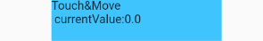
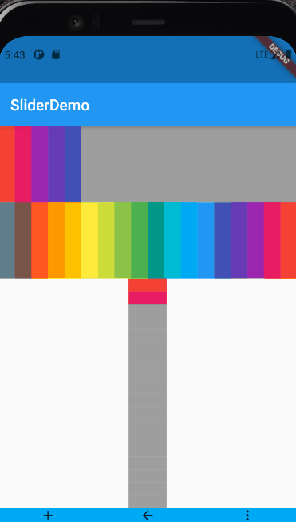

A simple plugin provides slide behavior. Package  offers a slide behavior base widget. Based on it, also provides a widget which can collects  multi AnimiationController to play when slide percentage reached controller's trigger value.

## Getting Start
The simplest way to use  `DragPercentageProvider` from package is shown below.This widget is important in this package because other widget use that to perform different behavior. By default, if you are not set intial value to DragPercentageProvider, it will be set to zero.The ValueNotifier will notify you the current percentage.

 

```dart
import 'package:flutter/material.dart';
import 'package:easy_slider/easy_slider.dart';

class SliderWithText extends StatefulWidget {
  const SliderWithText({Key? key}) : super(key: key);
  @override
  _SliderWithTextState createState() => _SliderWithTextState();
}

class _SliderWithTextState extends State<SliderWithText> {
  final ValueNotifier<double> vn = ValueNotifier<double>(0.0);
  @override
  void initState() {
    super.initState();
    n.addListener(() {
      setState(() {});
    });
  }

  @override
  void dispose() {
    n.dispose();
    super.dispose();
  }

  @override
  Widget build(BuildContext context) {
    return DragPercentageProvider(
      valListener: vn,
      child: SizedBox(
        height: 50,
        width: 200,
        child: ColoredBox(
          color: Colors.lightBlueAccent,
          child: Text("Touch&Move \n currentValue:${n.value}"),
        ),
      ),
    );
  }
}

```

## Usage
Package give you the most easily way to use DragPercentage.
Also, based on this widget, package also offered a widget called  ` DragWithAnimationController` which can play animiaton when drag percentage reached controller's trigger value.
### Demo
  1. [animated_icon]()
  2. [customPaint_with_controllers]()
  3. [reverse_CustomPaint]()
  4. [vertical_CustomPaint]()

 


## Feature
1. Reverse behavior. 
2. Support horizontal and  vertical drag.
